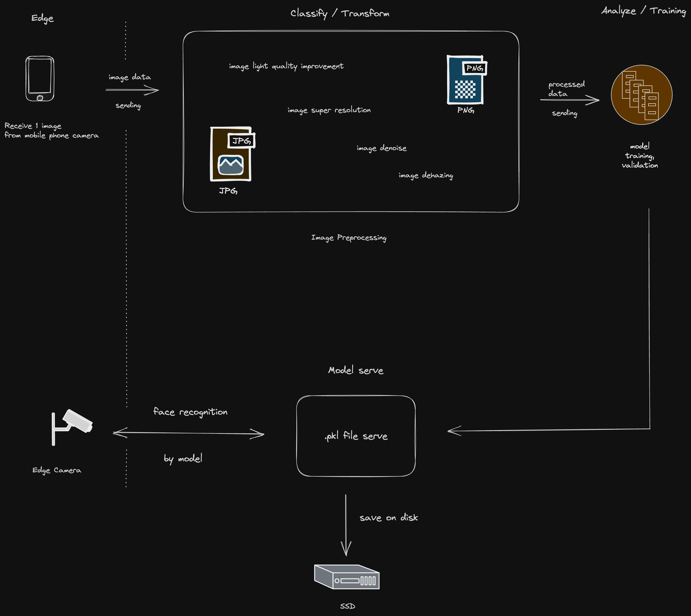

# Face Recognition Pipeline
Series: *One step to SOTA*
From *1 image* to edge face recognition.

### Why this pipeline shine?
Imagine you have limited resources, you want a realtime solution to serve face recognition model for specific person. This pipeline will have you to achieve that goal with speed and accuracy.
With just only 1 image for input, you will have a model with realtime running and ready to be served in edge devices (cameras, mobile phone,...)

## Installation steps
1. git clone https://github.com/transybao1393/face-recognition-pipeline .
2. Follow __Before doing anything__ part
3. Running steps

## Before doing anything
1. Download and create models to __mtcnn/models__ folder from URL https://drive.google.com/file/d/1TTdqNEqYjWTTMYGxm8IT6t41mRef-5Yu/view?usp=sharing
2. Create folder __mtcnn/training_data/processed__ and __mtcnn/training_data/raw__
3. Create folder __/preview__
4. Create folder __/video__

## Running steps
Please follow instruction in Makefile

## Next steps
- Multi processing and even better multithreading implementation for better memory and CPU usage.
- Python generator pipeline to optimize memory managment.
- Cython / Rust migration
- Improve speed and accuracy when multiple model recognition
- Image Ingestion layer to improve caching and data serving

## Support me

## License
This project is licensed under the [BSD-3-Clause](https://gist.github.com/nicolasdao/a7adda51f2f185e8d2700e1573d8a633#the-bsd-license-case) License - see the [LICENSE.md](LICENSE.md) file for details